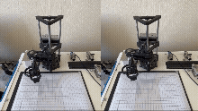

# SCARA Robot Smooth Motion Control

## Introduction

This project proposes an optimized motion control method for a stepper-motor-driven SCARA robot under short-stroke and high-frequency start-stop conditions.

## Demo

  

---
The method combines:

- RRT obstacle avoidance path planning
- Trajectory smoothing
- Asymmetric S-curve velocity planning
- Multi-axis synchronization
- Real-time pulse frequency control

The goal is to improve trajectory smoothness, joint coordination, and motion efficiency.

---

## Main Features

### Path Optimization
- RRT-based obstacle avoidance
- Cubic Hermite interpolation
- Gaussian smoothing
- Equidistant trajectory resampling

### Motion Planning
- Asymmetric S-curve velocity profile
- Nonzero boundary velocity constraints
- Jerk reduction and smooth acceleration/deceleration

### Multi-Axis Control
- Pulse-frequency-based synchronization
- Real-time stepper motor drive control
- Coordinated multi-joint motion
